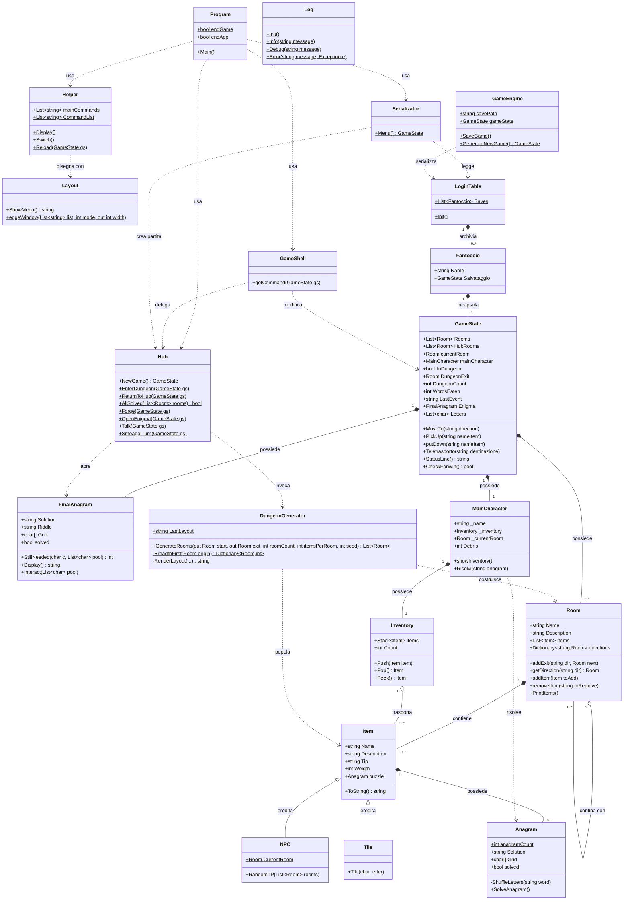

# Iperuranio — Game Design Document

*Bozza — versione 1.0*

---

## 1. Presentazione

**Iperuranio** è un'avventura testuale a interfaccia console in cui il giocatore, bloccato nel luogo platonico dove le parole esistono prima di essere pronunciate, deve ricomporre un enigma finale raccogliendo lettere in dungeon generati proceduralmente.

| | |
|---|---|
| **Genere** | Avventura testuale / roguelite a cicli |
| **Piattaforma** | Applicazione console, .NET 10 |
| **Linguaggio** | C# |
| **Librerie** | Spectre.Console (presentazione), log4net (diagnostica) |
| **Sessione tipo** | 20–40 minuti |
| **Giocatori** | Singolo |

---

## 2. Concept

Ogni oggetto del mondo è un anagramma di se stesso. Per interagire con qualcosa bisogna prima rimetterne in ordine le lettere: un oggetto con il nome scomposto non è ancora davvero quell'oggetto, e una persona con il nome scomposto non è ancora nessuno con cui si possa parlare.

Il gioco non chiede di risolvere molti anagrammi: chiede di **decidere quali anagrammi valgono la pena di essere riportati a casa**.

---

## 3. Ciclo di gioco

Il gioco alterna due spazi con regole diverse: una base fissa e scritta a mano, e dungeon usa e getta generati sul momento.

```
        ┌──────────────── BASE (fissa) ─────────────────┐
        │                                               │
        │   Risveglio → Atrio → Sala dell'Enigma        │
        │                 │  └→ Forgia                  │
        │                 └───→ Portale ────────┐       │
        └───────────────────────────────────────│───────┘
                                                │
                              ┌─────────────────▼─────────────────┐
                              │      DUNGEON (procedurale)        │
                              │                                   │
                              │  risolvi TUTTI gli anagrammi      │
                              │  scegli UNA parola da portare via │
                              │  raggiungi il Varco               │
                              └─────────────────┬─────────────────┘
                                                │
                                     ritorno alla Base
                                                │
                            Forgia: parola → lettere utili + scarti
                                                │
                            Sala dell'Enigma: inserisci le lettere
                                                │
                                        enigma completo → vittoria
```

### 3.1 Le cinque regole che generano il gioco

1. **Il varco si apre solo a dungeon completamente risolto.** Non si può scremare: o si risolve tutto, o non si esce.
2. **Si torna alla base con una parola sola.** Tutto il resto viene abbandonato.
3. **Il portale rifiuta chi ha oggetti addosso.** Obbliga a passare dalla Forgia prima di ripartire.
4. **La Forgia tiene solo le lettere che servono.** Il resto diventa scarto, contato ma inutile.
5. **Smeagol divora le parole risolte incustodite.** Risolvere un anagramma e lasciarlo lì non è sicuro.

La regola 1 impone il lavoro, la 2 impone la scelta, la 4 rende la scelta sbagliata punibile, la 5 impedisce di procrastinare. La 3 chiude il ciclo.

---

## 4. Meccaniche

### 4.1 Anagrammi

Ogni `Item` genera automaticamente un `Anagram` dal proprio nome. La risoluzione avviene in una schermata dedicata dove il giocatore sposta le lettere una alla volta (A/D per muoversi, Invio per prendere e depositare, S per rimescolare). L'anagramma è risolto quando la griglia coincide posizione per posizione con la soluzione.

Un oggetto non risolto:
- appare nella stanza con le lettere mescolate;
- non può essere raccolto;
- se è un NPC, non può essere interrogato.

### 4.2 Enigma finale

L'enigma della Sala Centrale è un anagramma **senza lettere**: dieci caselle vuote e un indovinello. Le caselle si riempiono solo con le lettere estratte alla Forgia. Il giocatore deve quindi risolvere due problemi distinti: dedurre la parola dall'indovinello, e procurarsi fisicamente le lettere per scriverla.

### 4.3 Forgia

Consuma la parola riportata dal dungeon e la scompone in lettere. Vengono trattenute solo quelle ancora necessarie all'enigma (contando quelle già possedute e già inserite); le altre diventano **scarti**, accumulati in un contatore.

Questo rende la scelta della parola da riportare una decisione di ottimizzazione: la parola più bella non è la più utile.

### 4.4 Smeagol

Antagonista non combattivo. Si aggira per il dungeon mentre il giocatore vi si trova.

| Situazione | Comportamento |
|---|---|
| Giocatore assente, parola risolta presente | La divora, poi resta fermo un turno |
| Giocatore presente | Fugge in una stanza adiacente senza mangiare |
| Altrimenti | Si sposta a caso |

Il giocatore riceve indizi sonori contestuali: se Smeagol è adiacente ne sente il trascinamento e la direzione. Mangia **solo parole già risolte**, mai anagrammi intatti: questo garantisce che non possa mai bloccare l'uscita.

---

## 5. Generazione procedurale

**Algoritmo:** random walk su griglia 7×7.

Partendo dalla cella centrale si sceglie una direzione casuale e ci si sposta, scavando una stanza nuova se la cella è vuota. Ci si sposta anche sulle celle già scavate: questo produce anelli e scorciatoie invece di un corridoio lineare.

**Proprietà garantita:** il percorso è contiguo per costruzione, quindi ogni stanza generata è raggiungibile da ogni altra. Non esiste il caso patologico della porzione di mappa isolata, che con un piazzamento casuale di stanze andrebbe rilevato e corretto a posteriori.

**Collegamento:** ogni coppia di celle adiacenti viene collegata in entrambi i sensi.

**Varco di uscita:** una visita in ampiezza (BFS) dalla stanza iniziale individua la stanza più distante, che diventa l'uscita. Questo assicura che l'attraversamento abbia sempre una lunghezza significativa.

**Difficoltà crescente:** il numero di stanze cresce con il numero di viaggi effettuati, fino a un massimo di dodici.

**Riproducibilità:** ogni generazione usa un seed esplicito, registrato nel log. Qualunque dungeon prodotto durante una partita può essere ricostruito identico a posteriori — requisito indispensabile per il debug di un sistema procedurale.

---

## 6. Comandi

| Comando | Effetto | Dove |
|---|---|---|
| `vai <direzione>` | Spostamento (nord/sud/est/ovest) | Ovunque |
| `focalizza <anagramma>` | Apre la risoluzione dell'anagramma | Ovunque |
| `raccogli <nome>` | Raccoglie un oggetto risolto | Ovunque |
| `molla` | Deposita l'ultimo oggetto raccolto | Ovunque |
| `inventario` | Mostra gli oggetti trasportati | Ovunque |
| `parla` | Dialoga con un NPC dal nome risolto | Stanze con NPC |
| `entra` | Genera e attraversa un nuovo dungeon | Portale |
| `torna` | Rientra alla base | Varco |
| `forgia` | Scompone una parola in lettere | Forgia |
| `enigma` | Apre l'enigma finale | Sala dell'Enigma |
| `teletrasporto` | Spostamento diretto (debug) | Ovunque |
| `aiuto` | Mostra/nasconde il riquadro comandi | Ovunque |
| `menu` / `esci` | Salvataggio e uscita | Ovunque |

---

## 7. Architettura del software

### 7.1 Suddivisione in responsabilità

| Livello | Classi | Responsabilità |
|---|---|---|
| **Avvio** | `Program` | Ciclo principale, orchestrazione |
| **Stato** | `GameState`, `MainCharacter`, `Inventory` | Dati della partita in corso |
| **Modello** | `Room`, `Item`, `NPC`, `Anagram`, `FinalAnagram` | Entità del mondo |
| **Regole** | `Hub`, `DungeonGenerator` | Logica di gioco e generazione |
| **Interfaccia** | `GameShell`, `Helper`, `Layout` | Input testuale e presentazione |
| **Servizi** | `GameEngine`, `Serializator`, `LoginTable`, `Fantoccio`, `Log` | Persistenza e diagnostica |

La separazione fondamentale è tra **modello** e **regole**: `Room` e `Item` non sanno niente del ciclo dungeon, e `Hub` non sa niente di come le stanze vengano disegnate a schermo. Il generatore produce oggetti `Room` ordinari, indistinguibili da quelli scritti a mano: il resto del codice non ha bisogno di sapere se una stanza è nata da un algoritmo o da una riga di codice.

### 7.2 Gestione delle due aree

`GameState.Rooms` designa **l'area attualmente attiva**, che sia la base o il dungeon corrente. La base resta parcheggiata in `HubRooms` per tutta la durata dell'esplorazione e viene ripristinata al ritorno; il dungeon abbandonato viene semplicemente dimenticato e raccolto dal garbage collector.

Questa scelta ha un vantaggio preciso: tutto il codice preesistente che ragionava su `Rooms` (spostamento, teletrasporto, riquadro comandi) ha continuato a funzionare senza modifiche dopo l'introduzione del ciclo a due spazi.

---

## 8. Diagramma delle classi

Notazione UML. `+` pubblico, `-` privato, `$` statico. Sono omessi i membri privati di puro supporto.



### 8.1 Note sulle relazioni

**`Room` ↔ `Room` (aggregazione riflessiva).** Il dizionario `directions` associa una stringa di direzione a una stanza confinante. È il grafo su cui poggia sia la mappa scritta a mano sia quella generata: la stessa struttura dati serve entrambe, ed è questo che ha reso possibile innestare la generazione procedurale senza toccare il resto del codice.

**`Item` → `Anagram` (composizione).** L'anagramma nasce e muore con l'oggetto: viene creato nel costruttore a partire dal nome. Di conseguenza, aggiungere una parola al gioco significa aggiungere un oggetto, non un enigma — l'enigma è implicito nel nome.

**`NPC` estende `Item`.** Scelta ereditata dalla struttura originale, con una conseguenza interessante: anche gli NPC hanno un anagramma, e quindi un nome da ricomporre prima di poterci parlare. La regola narrativa nasce dalla struttura dati, non viceversa.

**`Hub` e `DungeonGenerator` sono statiche e senza stato.** Ricevono il `GameState` come parametro e lo modificano. Nessuna delle due mantiene informazioni tra una chiamata e l'altra: Smeagol, ad esempio, non è tracciato da nessun campo, ma viene ritrovato scandendo le stanze. Questo elimina un'intera categoria di bug di sincronizzazione, al costo di una scansione irrilevante su una dozzina di stanze.

---

## 9. Persistenza

Il salvataggio serializza l'intero `GameState` tramite `BinaryFormatter`, incapsulato in un `Fantoccio` associato a un nome utente. L'intero grafo delle stanze, inclusi i riferimenti circolari tra stanze confinanti, viene gestito nativamente dal serializzatore.

**Limite noto:** `BinaryFormatter` è deprecato per ragioni di sicurezza e richiede l'abilitazione esplicita nel file di progetto. Una revisione futura dovrebbe migrare a `System.Text.Json` con risoluzione dei riferimenti, oppure a un formato proprietario in cui le stanze siano identificate per indice invece che per riferimento.

---

## 10. Diagnostica

Il logging è centralizzato in un wrapper su log4net che isola il resto del codice dalla libreria concreta. Vengono registrati: seed e forma di ogni dungeon generato, ingressi e uscite dai dungeon, esiti di ogni forgiatura, furti di Smeagol, risoluzione dell'enigma finale.

L'inizializzazione è protetta: un fallimento nella configurazione disattiva il logging senza impedire l'avvio del gioco.

---

## 11. Sviluppi futuri

- **Minimappa del dungeon**, disegnata dalle stanze già visitate (richiede coordinate memorizzate su `Room`).
- **Uso degli scarti**: la Forgia accumula un contatore attualmente senza sbocco. Potrebbe permettere di acquistare indizi o rigenerare un dungeon.
- **Dizionario esterno**: le parole sono attualmente codificate nel generatore; spostarle su file renderebbe il contenuto modificabile senza ricompilare.
- **Difficoltà degli anagrammi** calibrata sulla lunghezza e sulla frequenza delle lettere, non solo sulla distanza dalla partenza.
- **Migrazione della serializzazione** a un formato non deprecato.
